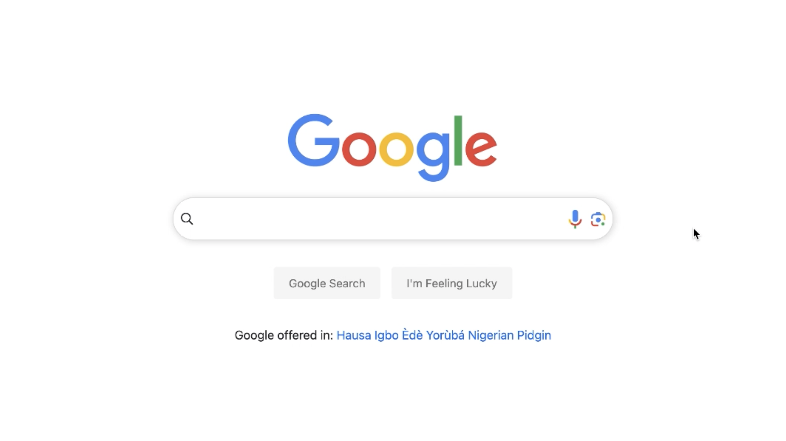

# CS50W Google Search Project

## Overview
This repository contains my first assignment of CS50 Web Programming with Python and Javascript, where I've created a simplified clone of Google Search, Google Advanced Search, and Google Images using HTML and SCSS.

## Video Demonstration
For a quick demonstration of this project and a walkthrough of its required specifications, watch this [YouTube video](https://youtu.be/kiakhTsyo44).

## Assignment Specifications
- **Pages**: The website includes three main pages: Google Search, Google Image Search, and Google Advanced Search. Users can navigate between these pages using links in the upper-right corner.

- **Query Text**: On the Google Search page, users can enter a search query, click "Google Search," and view the search results. The search bar and button are designed to resemble Google's interface.

- **Query Images**: The Google Image Search page allows users to input a query, click the search button, and view image search results.

- **Query Advanced**: The Google Advanced Search page provides input fields for specific search criteria, including "all these words," "this exact word or phrase," "any of these words," and "none of these words." The design mirrors Google's advanced search options.

- **Appearance**: The styling of this project adheres to Google's aesthetics. On the Advanced Search page, the four search criteria options are stacked vertically, and all text fields are left-aligned. The "Advanced Search" button follows Google's styling and functionality.

- **I'm Feeling Lucky**: An "I'm Feeling Lucky" button is added to the main Google Search page. Clicking this button directs users to the first Google search result for their query, skipping the normal results page.

- **Aesthetics**: The project's CSS strives to match Google's design as closely as possible, maintaining a consistent appearance throughout.

## Note
This project is intended for educational purposes only and does not constitute an official Google product or service.

Feel free to explore the code in this repository for a closer look at the implementation details.

Happy Coding!

